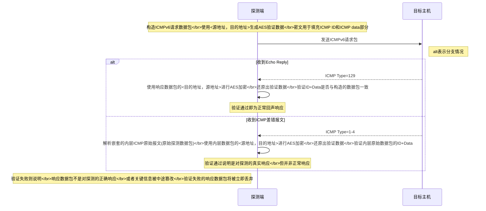
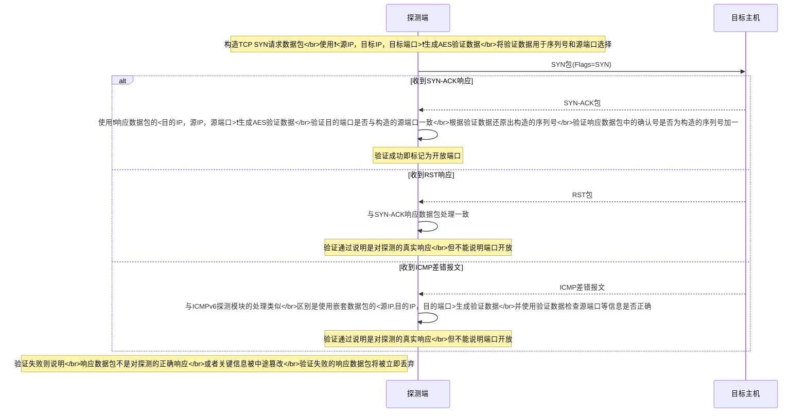

## 概述

**SMap**中内置了四种类型的探测模块，分别用于**活跃探测**，**拓扑与路由接口探测**，以及前两者的**自定义编码**探测模块。自定义编码模块用于**区域编码**等特定扫描技术，提高探测性能。

探测模块在`src/modules/probe_modules`的对应目录下编写，一般需要实现两个源文件：

- `mod.rs` 包括探测模块**定义**，用于构造的`new()`函数，以及用于线程初始化的`init()`函数，还有帮助接口。
- `method.rs` 为探测模块实现对应探测模块方法的特质。

!> 每个探测模块都需要在对应的地方进行声明。  
如IPv6活跃探测模块需要在`src/modules/probe_modules/active_probe/probe_mod_v6.rs`中的`PROBE_MODS_V6`数组进行声明，并在`new()`和`init()`中进行对接。

## 探测模块示例
!> 下文中验证为对探测的真实响应但并非正常响应的**不能**作为**判断地址是否存活**或**判断端口是否开放**的依据。  
比如，**ICMP差错报文不能作为地址存活的依据**，**TCP RST响应报文不能作为端口开放的依据**。  
SMap的活跃探测模块默认只输出**正常响应**，非正常响应（如RST响应）请使用参数`--allow_no_succ`。

### ICMPv6活跃地址探测模块

> ICMPv6活跃地址探测模块构造和发送ICMPv6请求数据包，并通过解析响应数据包来判断目标地址是否存活。模块路径：`src/modules/probe_modules/active_probe/v6/icmp/icmp_echo`
#### 时序图

### TCP SYN开放端口探测模块

> TCP SYN开放端口探测模块构造和发送TCP SYN请求数据包，并通过解析响应数据包来判断目标地址上的目标端口是否开放。模块路径：`src/modules/probe_modules/active_probe/v4/tcp/tcp_syn_scan`

#### 时序图

